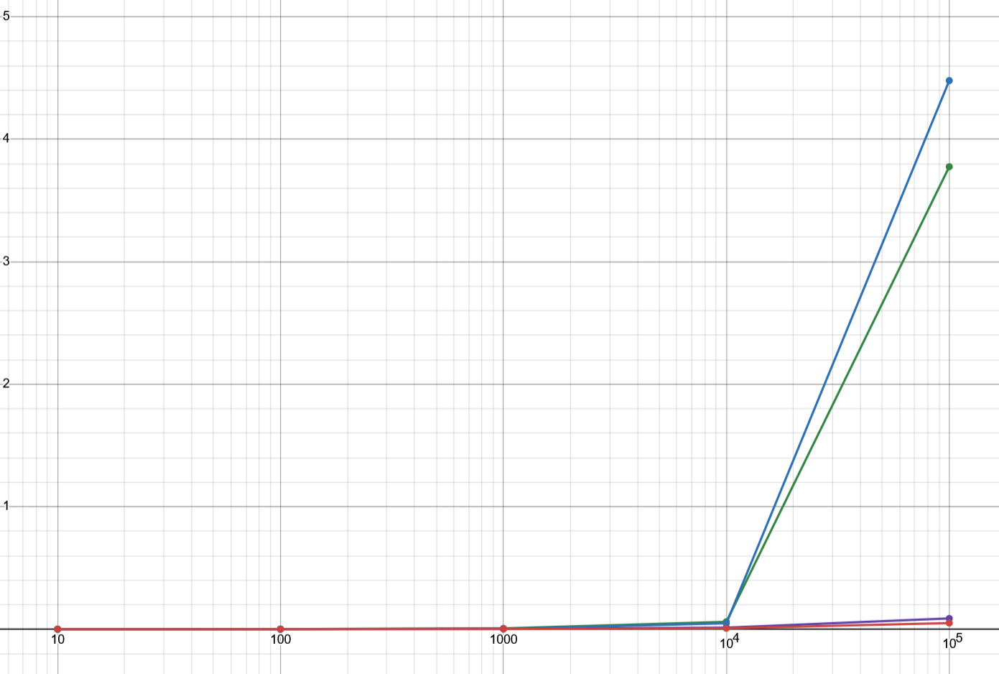

# Homework 4 writeup

The 4 sorting algorithms I chose to implement were as follows:
* Selection sort (complexity of $\Omega(n^2)$, because it has to iterate through $n$ elements to find the smallest, for every element out of $n$ elements that it sorts.)
* Merge sort (complexity of $\Omega(nlog(n))$, because the list has to be split into sub-lists $log(n)$ times, and then merging the lists together requires evaluating $n$ elements.)
* Insertion sort (complexity of $\Omega(n^2)$, because for every element out of $n$ elements that it sorts, it has to go through a maximum (worst case) of $n$ elements to be inserted in the right place.)
* Radix sort (complexity of $\Omega(d \cdot n)$, where $d$ is the number of digits in the largest number, because every digit of every number has to be evaluated.)

I tested them by running them on randomly generated lists of 10, 100, 1000, 10,000, and 100,000 elements. For each list size, I ran the algorithm on 3 lists of that size and averaged the runtimes.

The green, purple, blue, and red plots represent selection, merge, insertion, and radix sort respectively.